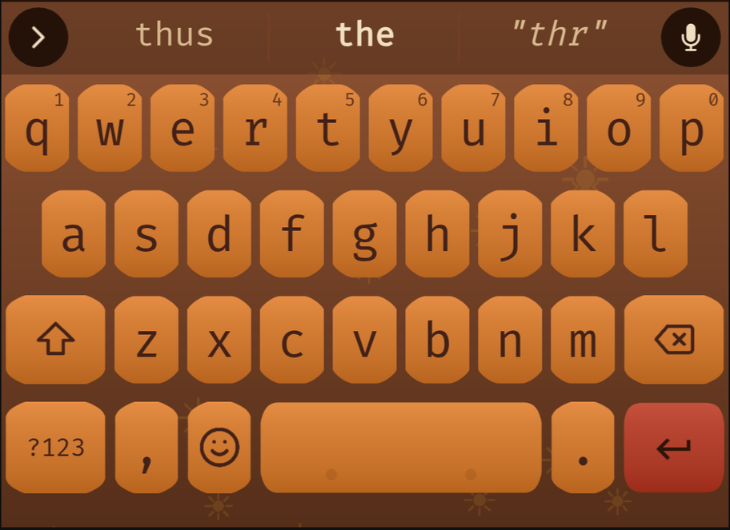

# Groovy Code — this repo's theme

"Groovy Code" is a warm-toned 70's palette (gold/orange/rust/brown) with an
orange accent, set in FiraCode. Currently at **v19**. The repo root *is* the
theme package — `theme.txt` plus PNG assets plus the font, ready to zip and
sideload into FUTO Keyboard's theme importer. See `docs/THEME-FORMAT.md` for
what every field in `theme.txt` means in general; this doc is about the
choices specific to this theme.

Screenshot above is a real render from `keyboard-theme-editor`'s own
rendering code (see "Verification method" below) — not a mockup. Not yet
confirmed on a real device.

## Design system

- **Palette:** gold `#e19d25`, orange `#e17a25`, orange-red `#e14e25`, rust
  `#bd361e`, clay `#b37545`, brown `#874725`, near-black `#422118`-derived —
  pulled from a "Warm-toned Groovy 70's" reference palette image. This
  remains the only source of color anywhere in the rendering, including
  the v17 redesign below — only the *structure* (well + inset face + gold
  rim) came from an external reference, never its colors.
- **Keycap structure, v17 — brown outer "well" + bright inset face + thin
  gold rim, on every key.** Replaces v15/v16's dark-charcoal-single-surface
  look entirely. See the v17 entry below for why and what.
- **Uniform orange face on every key, v18** — every non-action, non-
  stickyon key (every number, every letter, shift, backspace, ?123,
  comma, emoji, spacebar, period) renders in the exact same orange
  (`#e17a25`). v17 had instead brought back row-banding and a gold
  "system key" face, both of which turned out not to exist anywhere in
  the SVG reference that prompted v17 — see the v18 entry below for how
  this was caught and fixed. There is no more `normal row 0`/`row 1`/
  `row 2` matchrule distinction at all; a "normal" key and a "functional"
  key now render the same color (they're still separate assets/
  matchrules for architectural reasons — spacebar needs its own aspect
  ratio regardless — just no longer separate colors).
- **Organic "cookie"-shaped keys, v19** — every key's silhouette is now an
  irregular, slightly hand-drawn-looking rounded shape (flat stretchy
  edges, organically wobbled corners) instead of a clean rounded
  rectangle, plus a small brown sunburst motif marking `stickyon` and
  scattered across the background. This is a deliberate move *away* from
  the v18 SVG reference's literal clean vector rounded rects — see the
  v19 entry below for the direction change and why that's a considered
  trade, not a contradiction of v18's own fix.
- **Brightest gold face + a soft bloom** (`stickyon` asset) = caps-lock
  engaged — brighter than every other key's face and the only key with a
  colored bloom bleeding past its rim, deliberately, so the locked state is
  unmistakable at a glance. Confirmed as the real caps-lock-locked visual
  state, not just an icon change — see `docs/THEME-FORMAT.md`'s `stickyon`
  entry. Gold is now exclusive to this one state, freed up by v18 removing
  the gold system-key face.
- **True rust face + a modest bloom** = the `action` (enter) key —
  distinct from every other key's orange, matching the reference SVG's
  rust-red enter key exactly.
- **v12 mechanical-keyboard pass:** `gap` raised from `1` to `1.5` on every
  border asset (uniformly, so spacing stays even) to expose more
  background between keys — the single highest-leverage move in the
  mechanical guide. The dish/rim-highlight/shadow rendering was redone
  with a crisper, less-blurred highlight and a per-row gamma curve on the
  dish gradient (steeper on `row 0`, gentler on `row 2`) as a row-profile
  cue, and the spacebar got two subtle stabilizer-stem dimples.
- **v13 dish-squeeze fix:** the v12 keycap dish looked fine on every asset
  PNG viewed in isolation but rendered as a thin vertical sliver once
  actually imported and rendered as a real (non-square) key — see the bug
  entry below. Fixed by raising `target_density` from `480` to `640` on
  every border and icon asset (kept in sync, as before) — a pure
  `theme.txt` edit, no art regeneration needed.
- **v14 redesign — dark brushed-charcoal keycaps with an underglow,
  replacing the v12/v13 solid-color-ring look entirely.** Prompted by a
  reference mockup the user shared (a gaming-style keyboard: charcoal
  keycaps with visible brushed-metal texture, color expressed as a glow
  bleeding from under each key rather than filling the whole border, one
  key shown dramatically lit). The old `stickyon` "deliberately flat, no
  dish" design (see earlier versions of this doc) was replaced by that same
  reference: `stickyon` now gets a real dish like every other key, just
  with a much bigger/brighter glow — a "lit dish" reads as more clearly
  "on" than a flat color block, and matches the mockup's single glowing
  key directly. Per the user's standing instruction, every glow/tint color
  is still one of Groovy Code's own seven palette colors — nothing from the
  reference image's teal/purple/blue was borrowed; only the *technique*
  (dark cap + colored glow instead of solid ring) came from it. Technical
  notes: brushed-metal texture is directional (mostly-horizontal-blurred)
  noise built with numpy for speed/correctness — a pure-Python per-pixel
  version was tried first and had a silent near-zero-variance bug, worth
  remembering if you're tempted to hand-loop pixel-level image ops again.
  See `scripts/generate_assets.py` for the full technique
  (`make_brushed_texture`, `draw_bottom_glow`).

- **v16 — three procedural realism cues added, no new reference image
  this round.** The user asked to push the existing Pillow rendering
  toward photo-realism rather than sourcing an actual keycap image
  asset. Added in `render_key` (`scripts/generate_assets.py`):
  `apply_vignette` (numpy radial falloff, brighter up-and-left of center
  like a product photo lit from above, darker toward corners),
  `draw_edge_ao` (a thin blurred stroke just inside the rounded
  silhouette — the contact-shadow cue for where a keycap's flat top
  meets its side bevel, missing entirely before this), and
  `draw_specular` (a small tight bright ellipse, offset off-center,
  distinct from the broad gradient sheen v15 already had). All three are
  composited onto the full canvas rectangle (not clipped to the rounded
  mask individually) and clipped once at the very end of `render_key` —
  cheaper than re-clipping after every layer. Confirmed via
  `preview-theme` that glyph legibility isn't hurt by the highlight.
- **v15 redesign — the user said v14 "doesn't look like a mechanical
  keyboard," and a close-up photo of a real one they shared showed exactly
  why.** Three misses, in order of how much they mattered: (1) v14's glow
  filled roughly half the dish on *every single key* — the reference shows
  color as a small, tight, bright point of light right at the bottom edge,
  and only on a handful of keys (the number row, one demo key); most keys
  have no glow at all at rest. (2) v14 kept the v10-era "outer ring +
  inset dish + crisp highlight line" structure — the reference has no
  such split at all, just one continuous surface with a soft top-lit
  sheen. (3) v14's `gap = 1.5` was much wider than the thin seams in the
  reference. Fixed all three: `render_key` in `scripts/generate_assets.py`
  now renders a single gradient+texture surface with no dish/highlight
  objects, `draw_edge_light` replaces `draw_bottom_glow` with a small
  ellipse clipped tightly to the bottom edge (most keys pass
  `glow_color=None` and get no light at all), and `gap` dropped to `1.15`
  in `theme.txt`. Row-banding and the gold "system key" tint are now
  genuinely subtle (`tint_amount` down from ~0.14-0.30 to ~0.05-0.10) —
  intentional, to match the reference, but flagged in "Open items" below
  since it trades away a usability cue the theme used to have. As
  before, confirmed via `preview-theme`, not a real device yet.

- **v17 — reverted to solid colorful keys, replacing v15/v16's dark
  charcoal look entirely.** Prompted by a new reference: an SVG
  illustration of a mechanical keyboard with solid orange keycaps, a gold
  rim, a visible inset face on *every* key (not just system keys), and a
  rust-red enter key — a fundamentally different direction from v15/v16's
  dark-surface-plus-tiny-glow look. Rather than guess a fourth time on a
  subjective visual target (this repo's own stated lesson, see the v14/v15
  history above), the user was asked directly: keep v16's dark look, blend
  (dark keys with a visible rim/inset), or go back to solid colorful keys.
  **They chose reverting to solid colorful keys.** Implemented in
  `scripts/generate_assets.py`'s rewritten `render_key`: every key is now a
  brown (`#874725`) outer "well" body with a bright inset face offset in
  from the edges (asymmetric margins — less at the sides/top, more at the
  bottom, matching the reference) and a thin gold (`#e19d25`) rim stroke
  right at that boundary. Row-banding was brought back as a *solid* color
  per row (not the reference's uniform orange) since it's this theme's own
  established signature and closer to the old v10–v13 look, which is what
  the user's chosen option explicitly referenced. The action/enter key
  uses true rust (`#bd361e`, distinct from the row2 asset's *brightened*
  rust) to match the reference's rust-red enter key exactly, and
  `stickyon` keeps the brightest gold face plus the biggest bloom, per the
  existing "gold = locked" convention. Every v14–v16 photo-realism
  technique — brushed-metal texture, vignette, edge ambient-occlusion, the
  small specular highlight — was **dropped, not kept alongside the new
  structure**: those were built for a dark, textured, photographic read,
  and fight against a flat, saturated, vector-style solid-color look like
  the new reference. This wasn't explicitly asked for by the user's answer
  (which was about color/structure, not the realism techniques
  specifically), so flag it if the intent was to layer realism cues onto
  the new solid-color faces rather than drop them — a judgment call, not a
  certainty. A subtle vertical gradient on the inset face (~15% lighter at
  top, ~18% darker at bottom) was kept for a small hint of keycap
  dimensionality without reintroducing the heavy texture. Confirmed via
  `preview-theme` on QWERTY, Symbols, and Numpad — row-banding, the gold
  rim, and the rust enter key all read correctly on all three. Not yet
  confirmed on a real device.

- **v18 — fixed a real divergence from the reference SVG that v17
  introduced.** The user re-shared the exact same reference ("Mechanical
  keyboard illustration in a warm 70s palette") and said the theme looked
  nothing like it. Rather than guess again, the actual SVG markup was
  read line by line and rasterized to a PNG (no `cairosvg` available in
  this environment, so via a headless-Chromium screenshot instead) for a
  direct side-by-side against a fresh `preview-theme` render. The SVG
  turned out to show something more literal than v17 had implemented:
  every single key — every number, every letter across all three rows,
  shift, backspace, ?123, comma, emoji, spacebar, period — is the exact
  same solid orange (`#e17a25`) with a gold rim and a dark brown
  (`#422118`) legend; the *only* key that differs at all is Enter, which
  is rust (`#bd361e`) with a cream arrow icon. There is no row-banding
  and no separate "gold system key" color anywhere in the reference —
  v17's changelog entry had already flagged this exact tension (choosing
  "closer to the v10-v13 look" over the reference's literal uniform
  orange) but that judgment call turned out to be wrong once actually
  checked against the rendered reference image instead of just its text
  description. Fixed in `scripts/generate_assets.py`: `default`,
  `function`, and `space` all now render the identical orange (previously
  `default` was clay, `function` was gold, and row0/1/2 were orange-red/
  orange/brightened-rust — none of which the reference has). Removed the
  six `normal row 0/1/2 (pressed)` matchrules and their six asset blocks
  from `theme.txt` entirely, since letter keys no longer need per-row
  differentiation. Also corrected `foreground_tint` on every orange-faced
  asset from `#2a1508` (an undocumented ad-hoc dark brown that was never
  actually one of this theme's seven official palette colors) to
  `#422118` — the reference's literal legend color, and also this
  theme's own documented "near-black" palette swatch that `#2a1508` had
  been quietly substituting for since v17. `action`/`stickyon` keep
  `#2a1508`, unaffected by this fix since the reference doesn't cover
  those states. Confirmed via `preview-theme` on QWERTY, Symbols, and
  Numpad, all now uniformly orange as the reference shows. Not yet
  confirmed on a real device.

- **v19 — organic "cookie"-shaped keys, replacing the v12-v18
  rounded-rectangle structure entirely, across every theme in this repo
  including Groovy Code itself.** Prompted by the user pointing at a real
  published FUTO theme, "Animal Keys" by TrashKittyQueen
  (`p.trashkittyqueen.petkeys`) as their main inspiration and asking for
  "images like it." Downloaded the theme directly from
  https://keyboard.futo.tech/themes and inspected its actual assets
  rather than guessing from the name: its key art is NOT photographic
  animal imagery -- it's irregular, organic, "cookie"-shaped key
  silhouettes (not clean rounded rects), a handful of accent keys with a
  paw-print motif baked into the art, and a wood-plank background with
  paw prints scattered across it, low-alpha. That's the actual technique
  reproduced here (procedurally, matching this repo's whole generative
  approach, not by copying Animal Keys' own art or colors).

  Asked directly how far to take this, given Groovy Code had *just* been
  fixed in v18 specifically to match its own reference SVG's clean
  rounded rects: all 8 hardware variants only, or all 9 themes including
  Groovy Code. **The user chose all 9.** So this is a deliberate,
  explicitly-confirmed reversal of v18's shape fidelity, not an
  oversight -- Groovy Code's key SILHOUETTE now departs from that SVG's
  literal vector rounded-rect shape, while its COLOR identity (uniform
  orange, rust enter key, gold caps-lock, all fixed correctly in v18)
  stays exactly as it was and remains the thing "matching the reference"
  actually means for this theme going forward.

  Implementation: `scripts/keycap_render.py` gained `organic_mask()`
  (numpy, a rounded-rectangle signed-distance field whose effective
  corner radius is perturbed per-angle by a few random sine harmonics --
  flat edges get one perturbation each since the angle is constant along
  them, corners get the fully organic wobble) and `render_organic_key()`
  (the same well+face+rim structure as before, but every layer is a
  nested self-similar organic mask at shrinking radius instead of a
  rounded rect). **First attempt used a stretched ellipse instead** and
  produced pointy ends on the wide spacebar canvas (an ellipse's
  curvature scales with aspect ratio) -- caught by checking directly
  against Animal Keys' own `Button-space-dark.png`, which turned out to
  be a rounded-rect body with irregular corners and flat straight edges,
  not a full organic blob stretched end to end. That's exactly what a
  9-patch wants anyway (straight stretchy edges, detail only in the
  corners), so the SDF-based rewrite fixed both the visual bug and
  matched the real reference more closely at the same time. Slicing
  values are no longer Groovy Code's old fixed 0.18/0.052/0.206 (those
  were specific to a plain rounded rect at radius 26) -- every asset's
  slicing is now computed via `compute_slicing(radius_frac, size)` from
  its own organic `radius_frac`, landing at `[0.3187, 0.3187, 0.6813,
  0.6813]` for Groovy Code's own keys, which lines up closely with
  Animal Keys' own empirically-tuned `[0.3, 0.3, 0.7, 0.7]` -- a good
  sign the computed value is in the right range, not just internally
  consistent.

  A small brown sunburst motif (`motif_sunburst` -- a disc with radiating
  rays, this theme's own "70's groovy" glyph, the same role Animal Keys'
  paw print plays for itself) is baked into `stickyon`'s face and
  scattered low-alpha across a regenerated `GroovyCode-background.png`
  (previously untouched, plain dark texture, through all of v10-v18 --
  see the last "Open items" entry this closes out). Confirmed via
  `preview-theme` on QWERTY and Symbols -- organic shapes read cleanly at
  every role, hint labels aren't crowded, the sunburst motif is visible
  but subtle through the gaps between keys. Not yet confirmed on a real
  device.

## Build workflow

Assets are generated with Python + Pillow (PIL) + numpy (back in use as
of v19, for the organic-mask math -- v17/v18 had dropped it after
removing the v14-v16 photo-realism machinery, but the organic silhouette
itself needs vectorized per-angle math), not hand-authored, via
`scripts/generate_assets.py` (`pip install pillow numpy`) — run
`python3 scripts/generate_assets.py` from the repo root to regenerate all
10 non-icon `Button-*.png` border assets plus `GroovyCode-background.png`
in place (`default`, `function`, `space`, `action`, `stickyon`, each with
a `-press`/`-pressed` pair — down from 16 pre-v18, since row-banding's
six row0/1/2 assets were removed and never came back). Palette constants
live at the top of the script; geometry (`radius_frac`/`wobble`/
`margin_frac`) is passed to `render_organic_key` per call and must stay
in sync with `theme.txt`'s `slicing` values (see
`docs/THEME-FORMAT.md`'s "Computing slicing values" and
`scripts/keycap_render.py`'s `compute_slicing`) if you change it. The
actual `render_organic_key`/`organic_mask`/motif functions live in
`scripts/keycap_render.py`, shared with the classic-hardware variant
themes in `variants/` (see `docs/VARIANTS.md`) — this script just
supplies Groovy Code's own palette, motif choice, and per-asset role
mapping. It deliberately never touches `Icon-*.png`, `Button-morekey.png`,
or `Button-morekeysbox.png` — see the icon-regression bug below for why
that boundary is load-bearing, not incidental.

Icons: `Icon-backspace/shift/enter/emoji/globe/mic/arrow-left/arrow-right.png`
are straight rasterizations of FUTO's own SVGs — if you regenerate, re-clone
`keyboard-theme-editor` and convert `www/icons/*.svg` with `cairosvg` at
~288×288. `Icon-shift-press.png` (solid caps-lock arrow) and `Icon-tab.png`
are original, hand-drawn — no official SVG exists for either. See
`ICON-ATTRIBUTION.txt`/`FONT-ATTRIBUTION.txt` for the license terms this
theme ships under for third-party art/font.

## Bugs found and fixed (history — don't reintroduce these)

- **Icon regression (fixed v10):** the generation script originally
  hand-drew icons with PIL, then 8 were later replaced with proper
  conversions from FUTO's own SVGs. Re-running the *whole* generation
  script for unrelated changes (button shading, keycap shape) silently
  re-executed the old hand-drawn icon code and clobbered the official ones
  back — twice. **If you touch the generation script, either delete the
  dead hand-drawn icon code entirely, or make icon-restoration an atomic
  part of every regeneration run**, not a separate step you can forget.
- **Keycap dish contrast (fixed v11):** the concave "dish" inset was
  originally shaded with a fixed *absolute* RGB delta (~-14/channel). That
  reads fine on the bright orange action key (contrast ratio ~1.18) but is
  nearly invisible on near-black functional keys (~1.09) — confirmed via a
  real device screenshot where the enter key's dish was obvious and the
  letter keys' wasn't. Fixed by switching to *multiplicative* darkening
  (72%→40% of base color) plus a brighter rim highlight (alpha 40→95), so
  it scales correctly across the whole palette instead of one flat number
  tuned for one color.
- **Dish squeezed to a sliver on real (non-square) keys (fixed v13):** the
  v12 border assets' `slicing` fractions (0.18 uniform) were computed
  assuming a square 160×160 key. A real rendered key measured out to
  roughly a 0.72 width:height ratio (noticeably taller than wide), and
  since a 9-patch's fixed margin is an *absolute on-screen size* regardless
  of the key's actual shape, that same margin ate a much bigger fraction of
  the narrower width than the taller height — the dish read as a thin
  vertical column instead of a proper keycap face. Invisible from any
  single asset PNG (which only shows the asset at its own square native
  resolution); only visible once actually imported and rendered as a real
  key — caught using the `preview-theme` skill (`.claude/skills/
  preview-theme/`), not a real device. See `docs/THEME-FORMAT.md`'s "The
  9-patch margin is a fixed on-screen size" for the full mechanism and the
  general fix.
- **Icon-regression boundary is now enforced by code, not just discipline:**
  `scripts/generate_assets.py` structurally cannot touch `Icon-*.png` — it
  has no code path that writes those filenames at all, closing off the
  v10 bug class (see above) at the source rather than relying on
  remembering not to reintroduce it.
- **Row-banding matchrule ordering (historical, v12–v17 only):** while this
  theme had `normal row 0/1/2` matchrules, they had to sit AFTER the
  `action`/`spacebar`/`functional` rules and BEFORE the generic
  `pressed`/`normal` fallback — matchrules are order-dependent, first match
  wins (see `docs/THEME-FORMAT.md`). v18 removed row-banding entirely (see
  its changelog entry) so this no longer applies to Groovy Code itself,
  but the same ordering rule still matters if you reintroduce row-specific
  rules here, or add them to a `variants/` theme.
- **A judgment call flagged in an earlier version's changelog can still be
  wrong — verify against the actual reference, not just its text
  description.** v17's own entry explicitly flagged "closer to the
  v10-v13 look" as a deliberate departure from the reference SVG's literal
  uniform orange, reasoning that the user's chosen option text justified
  it. It didn't — the user said the result looked nothing like the
  reference. The fix (v18) came from actually rasterizing the SVG and
  comparing it pixel-by-pixel against a fresh render, not from re-reading
  the SVG's text description more carefully. When a visual claim is
  checkable against a concrete reference, check it that way before
  trusting a prior version's stated rationale.
- **Hint-label padding units:** `padding` on a border asset is a *raw*
  value, not a fraction of key size (see `docs/THEME-FORMAT.md`). A small
  decorative-looking value copied from a reference theme without checking
  units will crowd hint glyphs into the main letter. This theme keeps
  `padding = [0,0,0,0]` on every asset that has a letter/hint for this
  reason.

## Verification method

Every fix in this project was validated by (a) reading the actual
`keyboard-theme-editor` TypeScript source rather than guessing at the
format, (b) as of v13, rendering the theme for real with the
`preview-theme` skill (`.claude/skills/preview-theme/`) — which runs
`keyboard-theme-editor`'s actual rendering code locally via a headless
browser, not a real device — and (c) testing on a real device and
comparing a screenshot. (b) is what caught the v13 dish-squeeze bug that
(a) alone had missed for two versions; (c) is still the only way to check
real screen color/gamma, actual pressed/sticky-state interaction, and
`morekeysbox`/`morekey` (the editor's own preview stubs long-press to
always-false). **Don't declare a visual fix correct on the strength of (a)
alone if (b) is available, and don't call it fully confirmed without (c)
eventually happening.**

## Open items / not yet done

- **Whether to layer the v14–v16 photo-realism techniques back onto the
  current solid-color faces is an open judgment call, not something the
  user has decided.** Dropped in v17 because they fought against a flat,
  saturated look, and v18 didn't revisit this question — it only fixed
  the color-per-key-role mismatch, not the flat-vs-textured question. If a
  future round wants some photo-realism back (e.g. just a subtle texture
  on the inset face, keeping the flat gold rim crisp), ask rather than
  assume either way.
- ~15 other confirmed real icon IDs are unused (settings, numpad, undo,
  chevron_right, previous_key, etc. — full list in
  `docs/THEME-FORMAT.md`) — only the ones with a clear coding-relevant use
  case (tab, cursor arrows, globe, mic) have been wired up so far.
- `morekeysbox`/`morekey` (long-press accent popup) styling was added but
  never confirmed on a real device — the editor's own JS preview stubs
  these to always-false, so it can only be verified in the real Android
  app. They also weren't restyled for the current look (still the old
  gold-ring style from v11) since they can't be previewed to check the
  result — low priority, since they're only visible during a long-press.
- v11 through v19 have all been checked with the `preview-theme` skill's
  real render but **none of them have been screenshotted/confirmed on a
  real device yet** — that's the immediate next verification step. Real
  screen color/gamma and actual touch/pressed-state interaction still
  can't be checked any other way.
- The background (`GroovyCode-background.png`) was regenerated in v19 —
  no longer the original plain dark texture. It's now a brown gradient
  plate with the sunburst motif scattered across it at low alpha (see the
  v19 changelog entry above). Not yet confirmed on a real device — the
  motif density/alpha (`count=20, alpha=40`) was tuned by eye against the
  `preview-theme` render only; revisit if it reads as too busy or too
  faint on real screen gamma.
- The sunburst motif on `Button-stickyon.png` is the direct analog of
  Animal Keys' paw-print technique (a small glyph baked into one accent
  key's face, plus scattered across the background) — confirmed as the
  intended read when the user asked about it directly after v19 was
  built. Only `stickyon` carries the motif on a key face (not `action`),
  to avoid competing with the enter-key icon glyph; same restraint applied
  to all 8 `variants/` themes (motif baked into `stickyon` only, never
  `action`).
