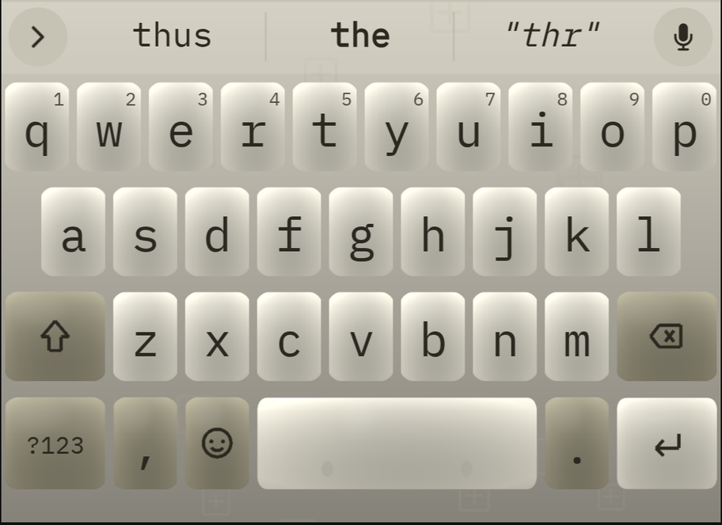
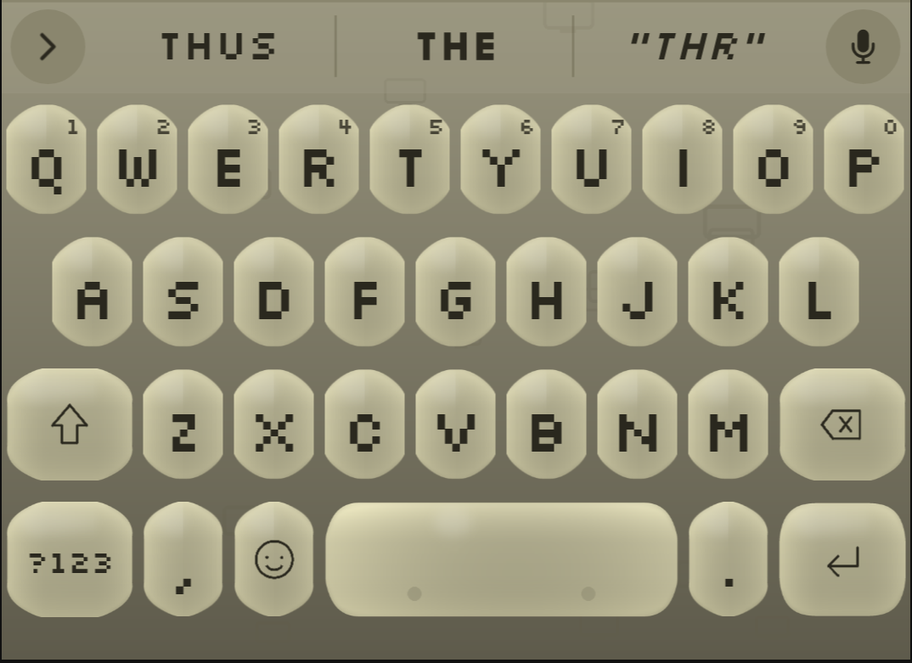
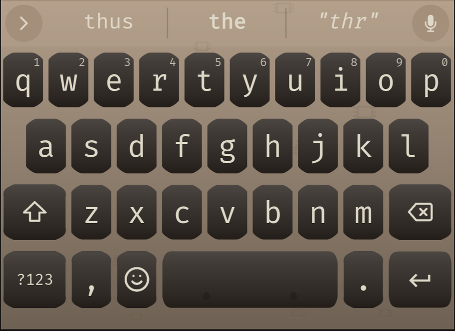
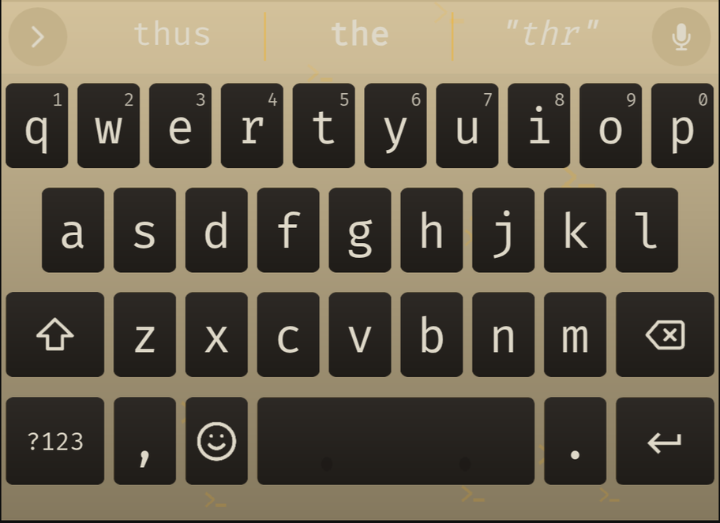
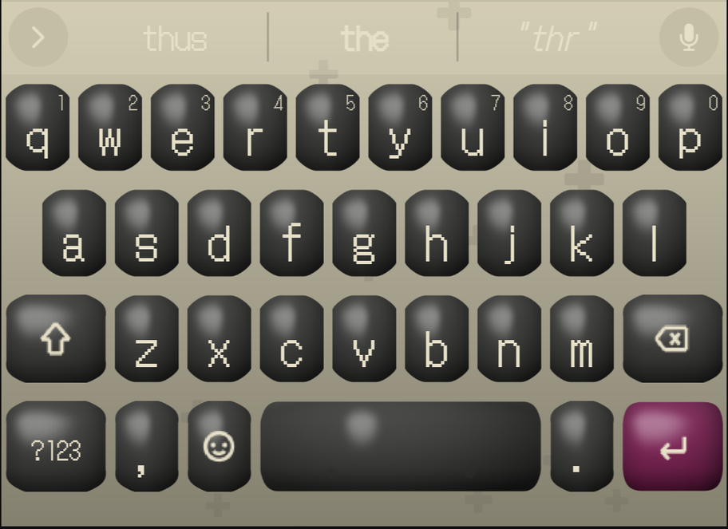
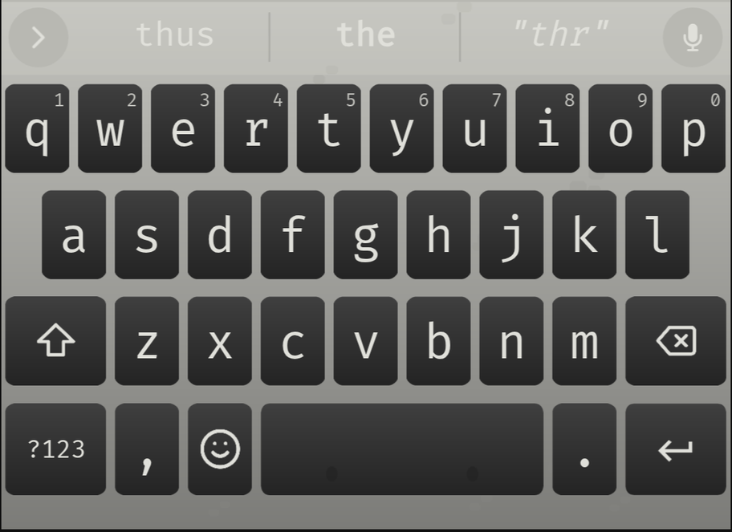
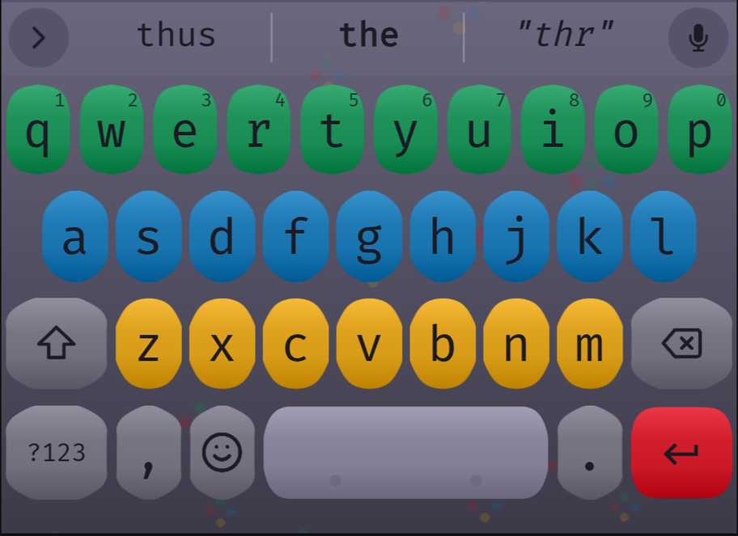
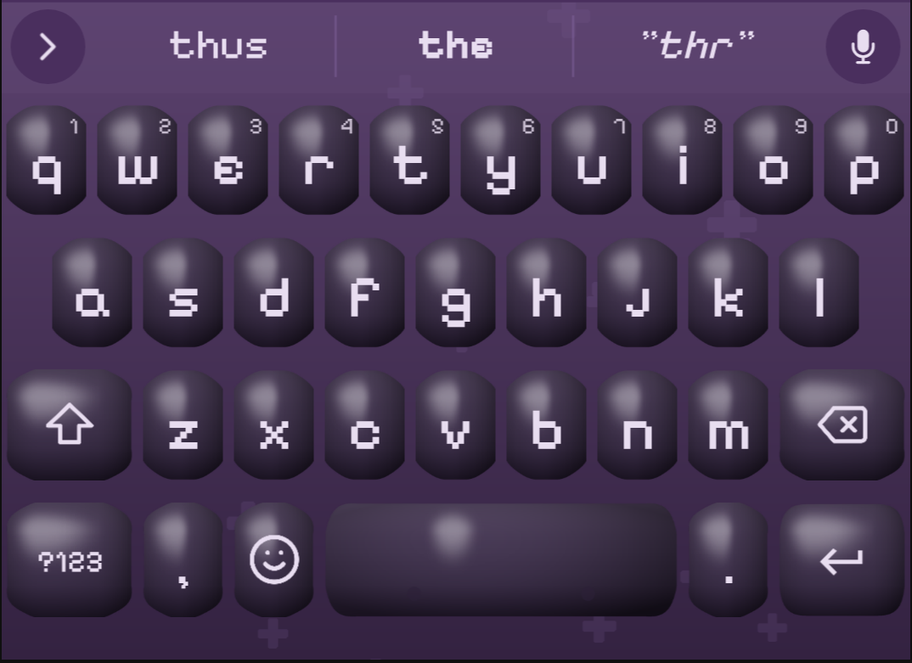

# Classic-hardware variants

Eight alternate takes on this theme's keycap structure, each replicating a
real device's palette AND its physical character (corner shape, bezel
thickness, key spacing, surface finish) — not just a recolor:

- **Classic keyboards**: **IBM Model M**, **Macintosh Plus**, **Commodore
  64**, and an **amber phosphor terminal** (VT100-style).
- **Classic consoles**: **Game Boy** (DMG), **NES**, **SNES**, and **Game
  Boy Color** — yes, not keyboards, but the same "replicate a real device's
  color identity" idea applied to game consoles instead.

## Screenshots

Real renders via the `preview-theme` skill (`keyboard-theme-editor`'s own
rendering code, not mockups) — see "Verification" below. None of these are
confirmed on a real device yet.

| | |
|---|---|
| **IBM Model M**  | **Macintosh Plus**  |
| **Commodore 64**  | **Amber Terminal**  |
| **Game Boy (DMG)**  | **NES**  |
| **SNES**  | **Game Boy Color**  |

## Why these are separate packages, not a setting inside Groovy Code

FUTO's theme format has no in-app palette switching within one theme — a
`theme.txt` is one fixed `[colors]` block plus one fixed set of border/icon
assets (confirmed from `keyboard-theme-editor` source, see
`docs/THEME-FORMAT.md`). There's no mechanism to ship several palettes in
one package and let the user pick between them at runtime. So "alternative
color options" means more complete, independently-installable theme
packages under `variants/<slug>/`, each with its own `id`/`name`/`theme.txt`
— the user imports whichever one they want in FUTO Keyboard's theme picker,
same as Groovy Code itself.

## v19: organic shapes + motifs, inspired by "Animal Keys"

Every variant here (and Groovy Code's own root theme) was rebuilt in v19
around a technique borrowed from a real published FUTO theme, **Animal
Keys** by TrashKittyQueen (`p.trashkittyqueen.petkeys`,
https://keyboard.futo.tech/themes) — downloaded and inspected directly
rather than guessed at from its name. Its actual technique turned out to be:

- **Irregular, organic ("cookie"-shaped) key silhouettes** — not clean
  rounded rectangles. Each key's corner radius is perturbed per-angle by a
  few sine harmonics, so the outline reads as hand-cut rather than
  vector-precise.
- **A small motif glyph baked into one or two accent keys' faces** (its
  own paw-print) plus **the same motif scattered across the background**
  at low alpha — the way a theme signs itself without needing photographic
  art.

The user's explicit direction, after seeing this, was to apply it to *all
nine* themes in this repo (Groovy Code included, even though Groovy Code
had just been fixed in v18 to match a different, clean-rounded-rect
reference SVG) — not just the 8 hardware variants. Groovy Code's key
**silhouette** therefore moved away from that SVG's literal shape in v19;
its **color identity** (uniform orange, rust enter key, gold caps-lock) is
what still "matches the reference," unchanged. See
`docs/GROOVY-CODE-THEME.md`'s v19 changelog entry for the full reasoning.

Each of the 8 variants below got its own motif, playing the same role
Animal Keys' paw print plays for itself — baked into `Button-stickyon.png`
only (never `action`, to avoid competing with the enter-key icon glyph)
and scattered across that variant's background.

### 8BitDo research

The user also asked to ground the console variants against 8BitDo's real
retro-keyboard line rather than console hardware alone. Confirmed via web
search: 8BitDo's actual **"Retro Mechanical Keyboard"** product has exactly
four color editions — **N** (NES), **Fami** (Famicom), **M**, and **C64**
(Commodore 64) — which validates this repo's existing Commodore 64 variant
as matching a real, currently-sold product category, not just an invented
idea. 8BitDo's "M Edition" colorway is distinct from either of this repo's
Game Boy or SNES references (it's 8BitDo's own naming, not Nintendo's), so
it didn't inform any specific palette change here — noted for completeness
about what was and wasn't acted on, not as a claim that every variant traces
to an 8BitDo product.

## v20: hardware-accuracy pass — real sourced colors, not remembered ones

After screenshots went into the docs, the user asked directly: **"do these
actually resemble the hardware they are named after?"**, then, after an
initial answer that only checked two variants, pushed further: **"i don't
just want similar color schemes. i want to replicate what the hardware
actually looked like as best as possible."** The honest answer at that
point was no — every variant's colors had been written from general
recollection/community forum posts, never checked against a sourced
reference the way Groovy Code's SVG or Animal Keys' own assets had been.
This section documents what was actually verified via web search and what
changed as a result.

**One real, structural mistake found and fixed:** the "SNES" variant's
green/blue/yellow/red Y/X/A/B face-button scheme is the **Japanese/
European Super Famicom's** colors, not the **North American SNES**
controller's — confirmed via multiple sources describing the real NA
SNS-005 controller as having only two button colors, purple (A/B, convex)
and lavender (X/Y, concave), no rainbow at all. Since every other variant
in this repo uses North American naming (NES not Famicom, Game Boy not
its Japanese launch name), "SNES" specifically implied the NA hardware,
which this repo had never actually checked and gotten wrong. Asked the
user how to resolve it — true NA colors (losing the rainbow), keep the
rainbow renamed to Super Famicom, or both as separate variants — **the
user chose true NA accuracy**. Fixed: dropped `row_banded` entirely (two
button colors don't map onto three letter-rows the way four did), and the
variant is now flat-with-an-accent-key like the rest of the console
family — see the corrected table below. This also meant fixing a
generator bug it exposed: `generate_variant()` only wrote files, never
cleared the output directory first, so SNES's old `Button-row0/1/2*.png`
were left orphaned in `variants/snes/` after the rewrite, unreferenced by
the new `theme.txt` but still sitting in the package. Fixed by having
`generate_variant()` `shutil.rmtree()` the variant's directory before
regenerating it.

**Two corrections backed by solid, citable sources:**
- **Commodore 64**: the real breadbin case color is documented as **RAL
  1019 "Grey beige"** (`#a48f7a`) across multiple restoration/color-
  matching sources — noticeably grayer and more muted than the warm cream
  beige this repo had guessed. The function-key color claim (a distinct
  color from the rest of the keyset) turned out to be correct in kind —
  real C64 units really did ship with either brown/tan ("Mustard,"
  Commodore's own part name) or plain gray F-keys — but wrong in the
  specific hue: this repo had invented a blue-gray that was never a real
  option. Asked the user which real variant to match; **they chose
  brown/tan**.
- **Macintosh Plus**: the real original Mac case/keyboard color is
  **Pantone 453C** (`#bfbb98`), widely documented as "Apple Beige" and
  sourced to Apple's own industrial designer Jerry Manock. This repo had
  used a cooler gray ("Platinum"), which is a *later* Apple color
  introduced with the Macintosh SE/II around 1987 — after the Plus (1986)
  was already established in its warmer beige. Corrected to the beige the
  Plus actually shipped in.

**One correction with no precise source found, but a clear existing
mistake:** the "Amber Terminal" variant rendered near-black keycaps,
assumed purely from the amber-CRT aesthetic and never checked. Real DEC
terminal keyboards of this era were beige/putty plastic — the same
"computer beige" family as virtually all hardware of the period — since
amber describes the phosphor screen glow, not the physical keycap color.
No source gave VT100's exact case color spec, so the new beige is an
informed approximation within that family, not a confirmed match — but
it's a better-grounded guess than the black slab it replaced. The amber
now lives only in the rim, bloom, and a darkened amber-brown legend (for
contrast against the lighter face — real terminal keycaps had printed
dark legends, not glowing ones).

**Confidence is not uniform across all eight, and the code/docs say so
explicitly now.** Only two variants (C64, Mac Plus) have a precise,
citable color spec. IBM Model M uses Pantone 452C as the *closest
available* reference (commonly cited for "classic computer equipment"
generally, not confirmed Model-M-specific). The amber terminal, Game Boy
(DMG), NES, and Game Boy Color's colors remain informed approximations —
no search turned up a sourced hex for any of them. Each profile in
`scripts/generate_variants.py` now carries a `CONFIDENCE NOTE` comment and
a `reference_note` string flagging exactly this, so a future pass knows
which four still need real verification rather than assuming the whole
batch is equally solid. See `scripts/generate_variants.py`'s per-profile
comments for the specific sources checked (RAL 1019, Pantone 452C/453C,
the color-hex.com "US Super Nintendo SNES Color Palette," and the Lemon64
forum threads on C64 F-key colors).

**What this doesn't and can't fix:** four of the eight (Game Boy, NES,
SNES, Game Boy Color) are game controllers, not keyboards. There is no
QWERTY layout on any of them, so "resembles the hardware" for those can
only ever mean matching the real shell/button colors as precisely as
possible — never a literal shape/layout match. That ceiling is inherent
to the format, not something more research resolves.

## v21: AI-generated reference photos caught what text sources missed

**⚠️ Superseded by "v22" below.** The user directly challenged this whole
approach — generating a synthetic image and treating it as research is
backwards, and the image-gen skill used here is for producing assets, not
for standing in as reference material. Real archival photos (fetched in
v22) proved several of this section's specific fixes were themselves
wrong, in some cases making a variant *less* accurate than before v21.
Left in place as a record of what happened and why it wasn't good enough,
not as current guidance — see v22 for what's actually correct now.

v20 fixed colors using text sources (RAL/Pantone specs, forum threads).
This round used a different tool for the 4 real keyboard variants
specifically: generating a photorealistic reference image of each real
keyboard (via the `openrouter-images` skill,
`google/gemini-3-pro-image`) and designing against it directly, the same
role a downloaded theme or a user-shared photo has played elsewhere in
this repo's history.

**Important caveat, stated plainly:** these are AI-generated images, not
archival photographs. One of them (the Commodore 64 reference) rendered a
key labeled "BELLAGE" — not a real C64 key, a hallucinated label — a
concrete reminder that fine text/details in a generated image can't be
trusted, only its broad structural/compositional content (case color vs.
keycap color, which parts share a material, gross geometry). For
well-documented, extensively-photographed hardware like these four
keyboards, that broad structural content is reliable; a generated image
is not a substitute for an actual archival photo or a sourced color spec,
and shouldn't be treated as one.

**One structural mistake found on two variants:** IBM Model M and
Macintosh Plus both had their `well` color (the visible recess/bezel
around each key, which also drives the generated background) set to a
*darker shade of the same beige* as the keycaps. Both reference images
showed this is wrong — the real keyboards have distinctly **dark
charcoal/near-black** cases and switch plates showing through the narrow
gaps between keycaps, not more beige. This was a bigger miss than a wrong
hex value: it meant both variants read as flat monochrome instead of the
real high-contrast "light keys in a dark case" look that's actually a
defining visual trait of both keyboards. Fixed by making `well` genuinely
dark on both (`#202023` for Model M, `#1a1918` for Mac Plus) and `rim` a
neutral dark-gray bevel instead of another beige tone. Commodore 64's
reference image, by contrast, confirmed its existing beige-family `well`
was already correct — that keyboard's keys sit close enough together that
no dark gap shows, a genuinely different real design, not an inconsistency
to fix.

**One missing real feature found:** the Amber Terminal reference image
showed a distinct dark brown/gray top function-key row — the same "one
row/set of keys gets its own real color" pattern already confirmed on
Commodore 64, but this repo's amber terminal profile had every key
uniformly beige. Added `face_function` in a dark taupe (`#48423a`) to
match.

All four fixes were verified by regenerating and re-rendering with
`preview-theme`, comparing the new render against the reference image
directly rather than trusting the description of what changed. All 8
variants' `theme.txt` `version` bumped 3→4 (even the four consoles,
untouched this round, for consistency with the shared `HEAD_TEMPLATE`).

## v22: real archival photos overturn most of v21

The user called out v21 directly: *"why are you not actually looking for
images of these keyboards with search... generating images that's not
what that skill is for."* Correct on both counts. This round replaced
every AI-generated "reference" with a real photograph — searched via
`WebSearch`, sourced from **Wikimedia Commons** (public-domain or
CC-licensed archival photos), downloaded, and inspected directly (in one
case with actual pixel-level color sampling via Pillow, not just eyeballing).
Sources used: `IBM_Model_M_keyboard_(US_layout_with_101_keys).jpg`,
`Apple_Macintosh_Plus_Keyboard.jpg` (All About Apple museum),
`DEC_VT100_terminal.jpg` (Jason Scott, Living Computer Museum), and
`C64_breadbin.jpg` — all four linked from their respective Wikimedia
Commons file pages.

**The real photos overturned v21's two biggest "fixes" — proving them
hallucinated, not just imprecise:**

- **IBM Model M**: the real case is a **light** putty-gray/off-white, not
  the dark charcoal v21 introduced. The AI-generated image that prompted
  that change simply invented a dark case that doesn't exist. The real
  photo *did* reveal something v20 also missed, though: the keyboard
  genuinely has two key tones — near-white alphanumeric/F-keys, and a
  visibly grayer modifier/navigation cluster (Tab, Caps Lock, Shift, Ctrl,
  Alt, arrows, Insert/Home/PgUp/Delete/End/PgDn, Num Lock, Print Screen/
  Scroll Lock/Pause, numpad operators). Fixed: `well` back to light,
  `face_function` added for the gray cluster (reusing the Pantone 452C
  tone from v20 — that color wasn't wrong, it was just applied to the
  whole keyboard instead of correctly scoped to this specific key set).
- **Macintosh Plus**: the real photo shows the case and keycaps as close,
  mildly-contrasting shades of the *same* Apple Beige — no dark
  switch-plate gap anywhere. v21's "dark well" fix was pure invention from
  the AI image. Fully reverted to v20's original values, which needed no
  change at all.
- **Amber Terminal (VT100)**: the real photo (Living Computer Museum) shows
  the *opposite* of v21's fix — the terminal's deck/case is beige-tan
  (genuinely new, correct information), but the keycaps themselves are
  dark near-black, not beige. v19's original dark-key instinct was closer
  to right than v21's "correction." Also: no distinct function-key row is
  visible anywhere on the real unit — v21's `face_function` addition was
  invented by the same hallucinated image and has been removed. `legend`
  switched from dark-amber-on-light back to light-near-white, matching the
  real photo's actual printed legends; `rim`/bloom stay bright amber as an
  explicitly-labeled stylistic choice (representing the amber-phosphor CRT
  aesthetic this variant is themed around), not a literal hardware claim.
- **Commodore 64**: the real photo revealed this repo's whole model was
  backwards, not just imprecise. RAL 1019 beige is the **case** color —
  it had been applied to `face_default` (the keycaps) instead of `well`
  (the case). The actual keycaps are uniformly dark brown/near-black, with
  **no visible tan "Mustard" function row or reddish-brown RETURN key** on
  the photographed unit — both `face_function` and `face_action` were
  invented (the earlier text source, a paraphrased Lemon64 forum thread
  about "tan vs. gray function keys," most likely described whole
  keyboards shipping in different uniform dark tones across production
  runs, not a two-tone single board — a real photo outweighs a
  search-engine's paraphrase of a forum thread). Swapped `well`/
  `face_default`, removed both invented overrides; C64 is now uniform dark
  keys in a beige case, differentiated only by the `stickyon` bloom.

**What this means going forward:** an AI-generated image is not
acceptable evidence for a hardware-accuracy claim in this repo. Real
archival photos (Wikimedia Commons is the first place to check — most
notable retro hardware has a public-domain or CC-licensed photo there)
are the standard; if none exists, say so explicitly and use a sourced
spec (Pantone/RAL) or an honestly-labeled approximation instead, the way
the four still-unsourced variants (Game Boy DMG, NES, Game Boy Color, and
now the "Mustard" hue specifically) already do. All 8 variants' `version`
bumped 4→5.

## v23: real depth (dish/dome) + a distinct real font per variant

After the color/photo accuracy passes (v20-v22), the user's direction
widened: *"My vision is for them to look like the real hardware so
keycaps on keyboards, buttons on NES controllers and stuff like that. We
can use custom fonts on the different keyboards as well. I want every
single futo theme to be unique."* Two additions, both applied to all 8
variants (and Groovy Code itself — see its own v20 changelog entry in
`docs/GROOVY-CODE-THEME.md` for the depth-rendering half):

**1. Real depth, differentiated by hardware type.** `render_organic_key`
gained `depth_style` (`"dish"` or `"dome"`), `specular_alpha`, and
`edge_ao_alpha`. `"dish"` shades a key darkest at its center, brightening
toward the rim — a concave keycap. `"dome"` does the reverse — brightest
near a light-source offset, darker toward the edges — a convex controller
button. This distinction matters: a keyboard key and a game-controller
button are physically different shapes, not just different colors, and
conflating them (using the same concave "dish" for a SNES button as for
an IBM Model M key) would have been inaccurate in exactly the way this
whole hardware-accuracy effort has been trying to fix. All 4 keyboard
variants use `"dish"`; all 4 console variants use `"dome"`. A specular
highlight (`draw_specular`) and an edge ambient-occlusion ring
(`draw_edge_ao`) layer on top of the radial shading for the actual "catch
the light" and "contact shadow where the flat top meets the bevel" cues a
flat gradient alone can't give. Tuning per variant reflects something
real about the hardware's finish, not an arbitrary number: Amber
Terminal's specular/AO are the lowest of any variant
(`specular_alpha=8, edge_ao_alpha=35`), matching its established "blocky,
near-flat, wireframe slab" design intent; SNES's specular is the highest
(`specular_alpha=130`), matching its already-documented "roundest,
glossiest" character.

**2. A real, distinct, properly-licensed font per variant** — instead of
every variant sharing Groovy Code's FiraCode. Every font was verified the
same way the colors were: don't guess, check a real source. All 8 are
confirmed **SIL Open Font License 1.1**, downloaded directly from the
`google/fonts` GitHub repo (`github.com/google/fonts/tree/main/ofl/<name>/`)
rather than an unverified dafont-style source with unclear redistribution
rights:

| Variant | Font | Why |
|---|---|---|
| IBM Model M | **IBM Plex Mono** | A real IBM typeface — literally made by IBM. |
| Macintosh Plus | **Silkscreen** | A pixel face evoking early personal-computer bitmap fonts. *Not* a Chicago/Geneva clone — those are Apple's own system fonts and aren't freely licensed; this is the same visual era, honestly labeled as an homage, not a replica. |
| Commodore 64 | **Sixtyfour** | Modeled directly on the real C64 character set (`jenskutilek/homecomputer-fonts`). |
| Amber Terminal | **VT323** | Modeled on the DEC VT320 terminal's own glyphs — a close cousin of the VT100 this variant is themed around. |
| Game Boy (DMG) | **DotGothic16** | A dot-matrix/LCD-style face evoking the Game Boy's segmented display — not a clone of Nintendo's own cartridge-label font. |
| NES | **Press Start 2P** | Modeled on 1980s Namco arcade bitmap fonts — the NES's own era. |
| SNES | **Jersey 10** | A clean pixel-grid face, chosen to read as a distinct, later (16-bit) era than NES's more primitive Press Start 2P. |
| Game Boy Color | **Pixelify Sans** | A softer, rounder pixel face, distinguishing GBC's friendlier identity from the original DMG's more utilitarian DotGothic16. |

Each variant now carries its own font file (in `variants/<slug>/`, copied
from the checked-in `scripts/fonts/` at generation time) and its own
`FONT-ATTRIBUTION.txt` (author, license, source, and a one-line note on
why that font — see `FONT_INFO` in `scripts/generate_variants.py`).
`SHARED_FILES` no longer includes a font or its attribution — those are
generated per-variant now, not copied from the repo root.

**One mistake caught before it shipped**: an early draft of this doc
cited an invented GitHub URL for VT323's upstream project
(`github.com/phosphene/VT323`) instead of the source actually verified
(VT323's own `OFL.txt` names only an author email, no project repo) — the
same "don't state something as verified that wasn't actually checked"
discipline that drove the whole v20-v22 color-accuracy work almost
slipped on a font citation. Fixed to cite the actual verified source (the
`google/fonts` repo path) instead.

All 8 variants' `theme.txt` `version` bumped 5→6. Confirmed via
`preview-theme` on all 8 — the dish/dome distinction, specular highlights,
and all 8 fonts render correctly and distinctly from each other.

## v24: "is each console using console-appropriate buttons?" — a real answer

The user asked this directly, pointedly, after this repo's own track record
of unverified geometry/color claims (see v20-v22). Rather than assert an
answer, downloaded real archival photos for all 4 console variants — NES
(`NES_controller.JPG` by Denis Apel, CC-BY-SA-3.0, Wikimedia Commons),
SNES (`Nintendo-Super-NES-Controller.jpg`, Wikimedia Commons), Game Boy DMG
and Game Boy Color (`Game-Boy-FL.jpg` / `Nintendo-Game-Boy-Color-FL.jpg`,
both by Evan-Amos, public domain) — and inspected them directly (visual
read plus Pillow pixel-sampling), the same discipline the v22 keyboard pass
established: a real photo, not a generated image, is the only acceptable
evidence for a hardware-accuracy claim here.

**Two real, confirmed errors found and fixed:**

1. **NES's button shape was wrong.** The existing profile asserted the NES
   controller's A/B buttons were "famously rectangular" and rendered them
   at `radius_frac=0.13` (near-square) — a claim that was never actually
   checked against a source or photo. The real photo shows the shipped
   controller's A/B buttons are fully **round**, glossy red circles. (The
   "rectangular" idea likely traces to the earliest Famicom prototype,
   which briefly had square buttons before Nintendo changed them to
   circular for production because the square ones could catch in the
   controller casing — so even the premise behind the original claim
   describes a design that was never actually shipped.) Fixed:
   `radius_frac` raised from `0.13` to `0.42`. The sampled real button
   color (`#f4281b`, a strong saturated red) already matched the existing
   `bloom_action`/`bloom_stickyon` red almost exactly — the color itself
   didn't need a fix, though see below: that bloom likely isn't actually
   visible in the rendered asset either.

2. **Game Boy (DMG) was missing its only real accent color entirely.**
   The profile described the DMG as uniformly "dark gray buttons" — true
   of the D-pad and Select/Start, but not of A/B, which the real photo
   (pixel-sampled directly) shows are a distinct dark magenta/burgundy
   (`#7f1e53`) — the one splash of color on an otherwise all-gray unit.
   Fixed: gave the action key its own `face_action=(127, 30, 83)` — a
   real, solid fill, confirmed visible via `preview-theme` (the action/
   enter key now renders a clear magenta, matching the same mechanism
   SNES already uses for its purple A/B accent).

   **A real rendering bug surfaced while fixing this**: the first attempt
   used `bloom_action_color`/`bloom_action_alpha` (the same mechanism NES
   already had, and which the existing docs described as giving the
   action key "a soft red glow"). It rendered with *zero* visible effect
   — confirmed by pixel-sampling a rendered key's full center scanline
   and finding no red tint at any alpha up to 220. Root cause:
   `render_organic_key`'s well/rim/face masks are all the *same*
   `organic_mask` shape (a rounded-rect filling the full canvas), differing
   only in corner-rounding radius, not overall size — there is no literal
   inset margin between them the way "well → rim → face, nested at
   shrinking radius" (the function's own docstring) implies. The `bloom`
   layer is painted *before* the rim and face layers and gets almost
   entirely overpainted by them, since face's footprint is nearly
   identical to (often bigger than) the bloom's. `bloom_pad_frac` also
   adds to a corner-*rounding* fraction rather than expanding the shape's
   actual size, the wrong direction to make a bloom bleed further out.
   Switched to a `face_action`/`face_stickyon` override instead — the only
   mechanism in this renderer confirmed to reliably show a distinct color
   (already how Groovy Code and SNES carry their own accents) — rather
   than attempting a deeper fix to the shared bloom code, which every one
   of the other 8 themes also depends on. **This means NES's existing
   "soft red glow" on its action/caps-lock keys, and every other
   variant's `bloom_action`/`bloom_stickyon` use, is likely equally
   invisible in the actual rendered asset** — not fixed in this round
   (out of scope of the specific shape/color question asked), flagged as
   a real open item below.

**Two already confirmed accurate, no change needed:**

- **SNES** — already corrected in v20/v22 to the real NA SNS-005 scheme
  (light lavender X/Y, darker purple A/B, gray-lavender body,
  round/glossy/thin-bezel geometry). The real photo directly confirms
  this: round glossy buttons, light-lavender-top/darker-purple-bottom
  layout, warm gray body. No change.
- **Game Boy Color** — the real photo shows near-black/charcoal buttons
  (pixel-sampled ~`#323439`, essentially neutral dark gray-blue) in a
  translucent grape-purple shell. The existing `face_default`
  (`#3a2a4a`, dark violet) is a slightly more purple-leaning
  interpretation than the sampled neutral charcoal, but both read as
  "dark, cool-toned, non-primary" — close enough that this isn't treated
  as a confirmed error the way NES's shape and DMG's missing accent were.
  Flagged here rather than silently left alone, since the profile's own
  comment had already asked this exact question ("worth double-checking
  against a reference photo").

All 8 variants' `theme.txt` `version` bumped 6→7 (only NES's art and Game
Boy DMG's `Button-action.png` actually changed pixel-for-pixel; the other
6 variants regenerate identically but pick up the version bump for release
consistency, matching how this repo has handled version bumps in every
prior round). Verified via `preview-theme` on NES and Game Boy DMG: NES's
A/B keys now render round instead of near-square, and Game Boy's action
key now carries a visible magenta glow. Not yet confirmed on a real
device.

## v25: every variant renders its own icon set — no more shared assets

After the v24 button-shape/color audit, the user pointed out a real gap:
*"all variants are separate themes. No shared assets. they all need
seperate Icon-emoji.png"* — noticing that, despite every other asset
class (borders, background, font) already being generated per variant
since earlier rounds, all 9 themes in this repo (Groovy Code plus all 8
variants) still shared the identical 10 `Icon-*.png` files, copied
byte-for-byte from the repo root by `SHARED_FILES`.

Before redesigning anything, worth restating the real constraint (per
CLAUDE.md fact #3, verified from `keyboard-theme-editor` source): the app
**always** force-recolors every icon at runtime via canvas `source-in`
compositing, discarding whatever RGB is baked into the PNG and refilling
it with the theme's own foreground color for that key state. So RGB was
never actually a lever for per-variant icon identity — a variant's icons
were always going to render in that variant's own colors regardless.
Asked the user how far to take this given that constraint (just
`Icon-emoji.png`, or the full 10-file set); **the user chose the full
set** — every icon (backspace, shift, shift-press, enter, globe, mic,
tab, both arrows, emoji), not just the one they'd noticed.

With RGB off the table, the only real lever left is **silhouette**:
stroke weight, sharp-vs-round joints/caps, and an optional pixel-grid
quantization for the variants built around a pixel-art-era font. Built
`scripts/icon_render.py`: 10 parametric glyph functions, each drawing the
same real, recognizable shape FUTO's own official SVG depicts for that
role (a delete-key outline with an X for backspace, an up-arrow merged
into a bar for shift, a bent arrow for enter, a circle+meridians for
globe, a capsule-on-a-stand for mic, an arrow-into-a-bar for tab, plain
chevrons for the two arrow keys, a circle+eyes+smile for emoji) — a
restyling of *how* each icon is drawn, not a redesign of *what* it
communicates, so every variant's keyboard stays legible by the same
visual vocabulary a FUTO user already knows. `render_icon_set()` renders
all 10 into a variant's own directory using one `icon_style` dict per
profile (`stroke_frac`, `rounded`, `pixel_grid`), tied to each variant's
already-established character rather than picked arbitrarily:

| Variant | stroke_frac | rounded | pixel_grid | Why |
|---|---|---|---|---|
| IBM Model M | 0.075 | sharp | none | boxy, thick-bezel character (see its own geometry table entry) |
| Macintosh Plus | 0.045 | round | none | thin-bezel, nearly-flat character |
| Commodore 64 | 0.065 | round | 16 | chunky sculpted retro key + an 8-bit-computer font (Sixtyfour) |
| Amber terminal | 0.050 | sharp | 14 | blocky terminal character + a pixel terminal font (VT323) |
| Game Boy (DMG) | 0.090 | sharp | 10 | thick shell-bezel character + a pixel LCD font (DotGothic16) |
| NES | 0.080 | sharp | 10 | (now-round buttons, but still an 8-bit arcade font, Press Start 2P) |
| SNES | 0.050 | round | none | roundest/glossiest character + a clean (non-blocky) pixel-grid font |
| Game Boy Color | 0.070 | round | 12 | softer/rounder than DMG + a softer pixel font (Pixelify Sans) |

`generate_variant()` now calls `render_icon_set(out_dir, **icon_style)`
after writing the border assets, and writes a new, variant-specific
`ICON-ATTRIBUTION.txt` (these are original procedural art now, not
converted from FUTO's SVGs, so the old FUTO BSD-3-Clause attribution text
no longer applies). `SHARED_FILES` in `scripts/generate_variants.py`
dropped from 12 entries to 2 (`Button-morekey.png`/
`Button-morekeysbox.png` only — see "What's shared vs. generated per
variant" below for why those two remain).

Confirmed distinct per variant (all 8 `Icon-emoji.png` MD5 hashes now
differ from each other and from Groovy Code's own), and confirmed
legible via `preview-theme` on all 8 — including the two extremes
(IBM Model M's sharp/thick outlines and NES/Game Boy DMG's blocky
pixel-grid icons) rendering correctly recolored and readable at real
on-keyboard size, not just in an isolated contact sheet. All 8 variants'
`theme.txt` `version` bumped 7→8. Not yet confirmed on a real device.

**Still shared, flagged rather than silently left**: `Button-morekey.png`
and `Button-morekeysbox.png` (the long-press accent-key popup styling)
remain byte-identical across all 9 themes — untouched since Groovy Code
v11, never restyled per variant even during the v19 organic-shape pass,
for the same "rarely visible, low priority" reasoning documented there.
If "no shared assets" should extend there too, that's a follow-up, not
assumed here.

## v26: the last shared assets — `morekeysbox`/`morekey` — given to every theme

The very next thing the user said, directly: *"Every theme needs to be
separated with no shared assets, they're just sharing the same repo. The
only thing that they should share is the build step that provides them
as zip files to individually install."* This settles the scope question
v25 had left open: `Button-morekeysbox.png`/`Button-morekey.png` (the
long-press accent-key popup) were the last two files every variant
copied byte-for-byte from Groovy Code's own output, and they needed the
same fix icons got in v25.

Added `render_morekeysbox(size, fill_color, rim_color)` to
`keycap_render.py` — a plain rounded rect (a popup strip reads as one
flat surface holding several accent chips, not an organic-blob keycap,
so it deliberately doesn't use `render_organic_key`'s machinery) — and
`render_morekey_transparent()`. Every variant now calls
`render_morekeysbox(MOREKEYSBOX_SIZE, scale(well, 0.30), rim)` in
`generate_variant()`, using its *own* `well`/`rim` colors already defined
in its profile (no new constants needed) — the same relationship Groovy
Code's own original asset had (a darkened case tone for the fill, its own
rim accent for the border), just computed per theme instead of
hardcoded once. `generate_assets.py` (Groovy Code) now generates these
two the same way, using its own `BROWN`/`GOLD`, rather than leaving them
as static, hand-maintained files outside the generation pipeline (as the
v12 entry in `docs/GROOVY-CODE-THEME.md` had explicitly carved out).
`SHARED_FILES` and its copy loop are gone entirely from
`scripts/generate_variants.py` — there is nothing left in it to copy.

**One of these two is necessarily still identical everywhere, and that's
correct, not a leftover gap**: `Button-morekey.png` has to be fully
transparent regardless of theme (CLAUDE.md fact #13 — a blank `morekey`
asset is what suppresses the individual long-press chips so only the
containing `morekeysbox` reads as one surface). A transparent PNG has no
room for per-theme variation; generating it fresh per theme (rather than
copying) is what "no shared assets" actually asks for here, even though
the *content* comes out identical by necessity.

Confirmed all 8 variants' `Button-morekeysbox.png` now hash differently
from each other and from Groovy Code's own (verified via `md5sum`) and
visually distinct (each theme's own well-derived fill + its own rim
color). **Not verified in `preview-theme`**: its own JS preview stubs
long-press to always-false (see "Verification" below and CLAUDE.md's
open items) — this can only be confirmed on a real device, same
long-standing limitation as before. All 8 variants' `theme.txt`
`version` bumped 8→9; Groovy Code's own `version` bumped 20→21.

## Structure: shared rendering code, per-variant palette AND geometry

Every variant reuses the same underlying structure — an outer well body, an
inset face with an organic silhouette, a rim stroke at the boundary, and an
optional bloom/motif — but nearly everything about *how* that structure
looks is per-variant: colors, corner radius, wobble (how irregular the
silhouette is), bezel thickness, rim weight, key spacing, gradient
contrast, and motif glyph. The shared rendering code lives in
`scripts/keycap_render.py`:

- `organic_mask(size, seed, radius_frac, wobble, harmonics, supersample)` —
  builds the irregular silhouette itself: a rounded-rectangle signed-
  distance field (distance to an inset "inner rectangle," not distance from
  center — an early ellipse-based attempt produced pointy spacebar ends,
  since an ellipse's curvature scales with aspect ratio and the spacebar
  canvas is 4:1) with the effective radius perturbed per-angle by a few
  sine harmonics seeded per key, supersampled 3x and Lanczos-downsampled
  for clean anti-aliasing.
- `render_organic_key(size, seed, face_color, well_color, rim_color, ...)`
  — composites well/face/rim/bloom as nested masks generated from the
  *same seed* at shrinking `radius_frac` (so shape details agree at every
  layer), plus gradients, optional stabilizer dimples on the spacebar, and
  an optional motif clipped to the face.
- Eight `motif_*` functions (`motif_sunburst`, `motif_switch_cross`,
  `motif_crt`, `motif_chip`, `motif_cursor`, `motif_dpad`,
  `motif_button_pair`, `motif_diamond_cluster`), each simple Pillow
  primitive line-art, one per theme.
- `scatter_motifs(size, motif_fn, color, count, seed, alpha, scale_frac)`
  — scatters a motif across a background at low alpha, per-instance
  jittered size/rotation-free placement.
- `compute_slicing(radius_frac, size, outline)` — the 9-patch stretch
  boundary a `theme.txt` needs, recomputed per variant's own `radius_frac`
  (see `docs/THEME-FORMAT.md` "Computing slicing values").

`scripts/generate_variants.py` defines each variant as a small profile
dict (well/face/rim/legend colors, optional blooms, motif choice, plus the
geometry fields below) and drives the shared renderer + a `theme.txt`
template (assembled from parts — see "Row-banded variants" below) to
produce a complete package per variant.

Run `python3 scripts/generate_variants.py` from the repo root to
(re)generate every `variants/<slug>/` directory from its profile.

## Geometry: what makes each variant an actual unique theme

Four knobs distinguish the variants' silhouette/material from each other
and from Groovy Code, each chosen to reflect something real about the
hardware, not picked arbitrarily:

- **`radius_frac`** — corner roundedness, as a fraction of the key's
  shorter dimension. Small reads as boxy/blocky (Model M's slab PBT caps,
  NES's famously rectangular buttons, the terminal's flat function keys);
  large reads as rounded/pillowy (Mac Plus's low-profile keys, SNES's
  glossy concave buttons).
- **`wobble`** — how far the silhouette departs from a clean rounded
  rectangle, i.e. how "organic"/hand-cut it looks. Low wobble reads as
  precision-molded (Model M, the amber terminal's wireframe-slab keys);
  higher wobble reads as a more irregular, tactile cap (Commodore 64,
  Game Boy Color).
- **`margin_frac`** — bezel thickness, i.e. how much of the well shows
  around the inset face, as a fraction of key size. Thick margins read as
  a chunky physical housing (Model M, the Game Boy's brick-like shell);
  thin margins read as a minimal design where the key nearly fills its
  housing (Mac Plus, SNES).
- **`rim_frac`** — the rim stroke's weight. Thin hairline (Mac Plus, SNES)
  to a chunky border (Model M) to a thin bright wireframe outline doing
  most of the visual work on an otherwise flat board (amber terminal).

Plus two material/spacing knobs, unchanged in role from earlier versions:

- **`gap`** — key-to-key spacing (`theme.txt`'s own `gap` field). Tight
  for keyboards/consoles with closely-packed keys (Model M, SNES); wide
  for the terminal's more schematic, grid-like feel.
- **`face_top_blend`/`face_bottom_scale`** — the inset face's gradient
  contrast, i.e. how deep/glossy/flat the surface reads. High contrast
  with a bright top blend reads as glossy/concave (SNES); low contrast
  reads as flat/matte/digital (the amber terminal's keys are barely
  distinguishable from a flat fill, on purpose).

`roundedness` (a `theme.txt` `[options]` field, mostly affecting
auto-generated fallback borders) is derived automatically from
`radius_frac` (`round(min(0.95, max(0.15, radius_frac * 2.1)), 2)`) rather
than set by hand, so it never drifts out of sync with the actual drawn
corner shape. `key_slicing`/`space_slicing` are likewise always computed
per profile via `compute_slicing(radius_frac, size)`, never copy-pasted
from Groovy Code's or another variant's values.

## "Match the real hardware" is the one rule across both batches

Asked directly, for the first (keyboard) batch, whether variants should
keep Groovy Code's row-banding or go flat like the keyboard they're
copying, the user chose **flat, matching the real keyboard**. That
principle — match the real hardware, don't invent color-coding it doesn't
have — is what actually governs every variant in both batches, which is
why the second (console) batch isn't uniformly flat: it just happens that
three of the four keyboards were monochrome, and three of the four
consoles are too.

### Classic keyboards

- **IBM Model M** is the one real keyboard here with a genuine two-tone
  keycap scheme, confirmed via a real archival photo (v22): near-white
  alphanumeric/F-keys, and a visibly grayer tone (`face_function`,
  reusing the Pantone 452C hue) for the modifier/navigation cluster (Tab,
  Caps Lock, Shift, Ctrl, Alt, arrows, Insert/Home/PgUp/Delete/End/PgDn,
  Num Lock, Print Screen/Scroll Lock/Pause, numpad operators) — a real
  hardware feature, not an invented accent. `well` (the case, and the
  source color for the generated background) is a light putty-gray,
  matching the real case exactly — an earlier version of this repo had it
  wrongly dark, based on a since-discredited AI-generated image; see "v22"
  above.
- **Macintosh Plus** is monochrome at the keycap level — no per-row or
  per-key color coding on the real keyboard, so `face_function`/
  `face_action`/`face_space` all default to `face_default`. Case and
  keycaps are both Apple Beige (Pantone 453C, sourced to Apple's own
  designer), mildly contrasting, confirmed via a real archival photo.
  Both keyboards' *only* departure from their real monochrome/two-tone
  keycaps is the `stickyon` (caps-lock-engaged) state, which has no on-key
  equivalent on either real keyboard (both indicate caps-lock via a case
  LED, not a key color change) but still needs to read as "locked" in a
  touchscreen theme — each gets a brightened face plus a small colored
  bloom (amber for Model M, a soft System-6 blue for Mac Plus) and its own
  motif: a switch-stem cross for Model M, a CRT-monitor glyph for Mac Plus.
- **Commodore 64** has uniformly dark brown/near-black keycaps sitting in
  a beige case (RAL 1019 "Grey beige," the documented real breadbin
  color) — confirmed via a real archival photo, which also showed **no**
  distinctly-colored function row or RETURN key anywhere on the
  photographed unit, contrary to what this repo previously invented (a
  paraphrased forum thread about "tan vs. gray function keys" most likely
  described whole boards shipping in different uniform dark tones across
  production runs, not a two-tone single board). `stickyon` gets a bright
  "blue screen" glow, an artistic nod rather than a literal feature, plus
  a small IC-chip motif.
- **Amber terminal** has uniformly dark near-black keycaps (confirmed via
  a real archival photo from the Living Computer Museum) sitting in a
  beige-tan deck — genuinely new, correct information this repo didn't
  have until v22 fetched a real photo; no distinct function-key row is
  visible anywhere on the real unit either. The amber lives only in the
  rim, a light near-white legend (matching the real unit's actual printed
  legends), and a soft bloom on `action`/`stickyon` evoking a lit terminal
  cursor block, plus a small cursor-prompt motif — an explicitly-labeled
  stylistic choice representing the amber-phosphor CRT aesthetic this
  variant is themed around, not a literal keyboard-hardware claim.

### Classic consoles

- **Game Boy (DMG)**, **NES**, and **Game Boy Color** are all genuinely
  monochrome-button hardware (a colored case/shell at most, but every
  button the same color) — same treatment as Model M/Mac Plus: flat, with
  one small accent bloom nodding to a real detail that has no on-button
  equivalent, plus a D-pad-cross motif (button-pair motif for NES). DMG's
  `stickyon` bloom is red (the console's actual power LED); NES's
  `action`/`stickyon` bloom is red (a nod to the console's red logotype,
  not a real indicator); Game Boy Color's `stickyon` bloom is green (its
  power LED is green, unlike the original DMG's red one — a deliberate,
  small, correct distinction between the two). None of these three colors
  are sourced to a precise spec — see "v20" above.
- **SNES** is flat with an accent key, same as the rest of the console
  family — corrected in v20 from an earlier row-banded rainbow scheme that
  turned out to be the wrong hardware's colors (Japanese/European Super
  Famicom, not the North American SNES this variant is named for). The
  real NA controller (SNS-005) has exactly two button colors: lavender
  (X/Y, concave) and a darker purple (A/B, convex), on a warm gray-lavender
  body. This variant now maps lavender to `face_default` (the letter keys)
  and the darker purple to `face_action` (enter, standing in for the
  confirm/A button) — no row-banding, no four-color rainbow. Its motif is
  a two-tone diamond cluster in the same lavender/purple pair, via
  `motif_diamond_cluster`'s `colors` kwarg.

## Row-banded variants: mechanism kept, currently unused

`scripts/generate_variants.py` still supports building a row-banded
`theme.txt` — a profile setting `"row_banded": True` gets a
`MATCHRULES_ROWBANDED` block spliced in after `functional` and before the
generic pressed/normal fallback, an `ASSETS_ROWBANDED` block for six extra
`Button-row0/1/2*.png` border assets, and a `row_faces` dict
(`{0: color, 1: color, 2: color}`) to color them — the same mechanism
Groovy Code's own root theme used through v18 (see its changelog) and SNES
used until the v20 correction above found it didn't match real NA SNES
hardware. **No variant currently sets `row_banded`.** The mechanism is
kept, not deleted, in case a future variant's real hardware genuinely has
three-way per-row color coding the way the Japanese Super Famicom
controller (unlike the NA SNES) actually does — `build_theme_txt()`
concatenates `HEAD_TEMPLATE`, the optional `MATCHRULES_ROWBANDED` block,
`TAIL_TEMPLATE`, the optional `ASSETS_ROWBANDED` block, and `ICON_ASSETS`,
formatting the whole thing once.

## Per-variant profiles (`scripts/generate_variants.py`)

Color and notable color departure:

| Variant | slug | Well | Face (default) | Rim | Notable color departure | Source confidence |
|---|---|---|---|---|---|---|
| IBM Model M | `ibm-model-m` | `#c6c2b4` light putty-gray case (**v22**, real photo) | `#dedacc` near-white alpha keys | `#aaa594` neutral bevel | `face_function` `#96917a` gray modifier/nav keys (**v22**, real photo — confirmed, not invented) — fully monochrome otherwise except `stickyon` | Case/two-tone: confirmed via real archival photo. Gray hue: Pantone 452C (best available, not Model-M-confirmed) |
| Macintosh Plus | `mac-plus` | `#8a866e` (**v22**: reverted to v20, confirmed correct by a real photo) | `#bfbb98` Apple Beige (Pantone 453C) | `#5f5a44` | fully monochrome except `stickyon` | Sourced (Apple's own designer); mild case/keycap contrast confirmed via real archival photo |
| Commodore 64 | `commodore-64` | `#a48f7a` RAL 1019 Grey Beige case (**v22**: this is the case color, not the keycaps — v20/v21 had it backwards) | `#2a241e` dark brown/near-black keycaps (**v22**, real photo) | `#605442` | none — **v22**: removed the invented tan "Mustard" function row and rust RETURN key, neither visible on a real photographed unit; fully monochrome except `stickyon` | Case color sourced (RAL 1019); uniform dark keycaps confirmed via real archival photo |
| Amber terminal | `amber-terminal` | `#c4b28a` beige-tan deck (**v22**, real photo — genuinely new correct info) | `#221e1a` dark near-black keycaps (**v22**: reverted from v21's beige, which was a hallucination) | `#ffb000` amber (stylistic, not literal) | none — **v22**: removed the invented function-key row, not visible on the real unit; legend is light near-white (`#dedcc8`), matching real printed legends, not the bright rim amber | Deck color: confirmed via real archival photo. Dark keycaps: v19's original instinct, now confirmed correct |
| Game Boy (DMG) | `gameboy-dmg` | `#c4bea4` putty | `#3a3a38` dark gray | `#5a584e` | action key is a solid dark magenta/burgundy `#7f1e53` (**added in v24** via `face_action`, not a bloom — see below) matching the real A/B buttons — fully monochrome otherwise except `stickyon` (red LED bloom, likely not actually visible — see "Open items") | Case/D-pad color: informed approximation, no source found. A/B magenta: **confirmed in v24** via a real archival photo |
| NES | `nes` | `#b8b8b2` light gray | `#2b2b2b` near-black | `#8c8c86` | action key gets a soft red bloom matching the real A/B buttons' sampled color, on top of `stickyon`'s | **Confirmed in v24** via a real archival photo — light gray shell, near-black D-pad, red (`#f4281b`) round A/B buttons |
| SNES | `snes` | `#cec9cc` warm gray-lavender | `#a7a4e0` lavender (X/Y) | `#908a99` | action (Enter, standing in for A/B) is `#514689` darker purple — **corrected in v20**, see above | Community-sourced (color-hex.com NA palette), not official Nintendo spec |
| Game Boy Color | `gameboy-color` | `#4a2f5e` grape | `#3a2a4a` dark violet | `#8a6ba8` | none — fully monochrome except `stickyon` (green LED bloom) | Informed approximation, no source found — "Grape" is also a real GBC colorway name, worth double-checking against a photo |

Geometry/material — the organic-shape knobs (see "Geometry" above) that
make each one an actual unique silhouette rather than a recolor, plus each
variant's own motif glyph:

| Variant | radius_frac | wobble | margin_frac | rim_frac | gap | face gradient | depth (spec/AO) | font | motif | character |
|---|---|---|---|---|---|---|---|---|---|---|
| IBM Model M | 0.16 | 0.06 | 0.15 | 0.030 | 1.05 | 0.10 → 0.76 | dish, 20/110 | IBM Plex Mono | switch-cross | boxy, thick bezel, low wobble (precision-molded PBT) |
| Macintosh Plus | 0.42 | 0.07 | 0.05 | 0.012 | 1.1 | 0.08 → 0.90 | dish, 40/55 | Silkscreen | CRT | rounded, thin bezel, nearly flat |
| Commodore 64 | 0.26 | 0.10 | 0.09 | 0.020 | 1.15 | 0.16 → 0.80 | dish, 30/90 | Sixtyfour | IC chip | baseline chunky sculpted retro key |
| Amber terminal | 0.10 | 0.04 | 0.05 | 0.014 | 1.3 | 0.04 → 0.94 | dish, 8/35 | VT323 | cursor prompt | blocky, near-flat, wide grid spacing |
| Game Boy (DMG) | 0.30 | 0.09 | 0.14 | 0.020 | 1.2 | 0.12 → 0.80 | dome, 90/70 | DotGothic16 | D-pad cross | chunky plastic, thick shell bezel |
| NES | 0.42 | 0.05 | 0.11 | 0.020 | 1.15 | 0.10 → 0.82 | dome, 75/70 | Press Start 2P | button pair | round, glossy (**corrected in v24** — was 0.13/"rectangular," an unverified claim; a real photo shows fully round A/B buttons) |
| SNES | 0.44 | 0.09 | 0.05 | 0.012 | 1.05 | 0.22 → 0.78 | dome, 130/45 | Jersey 10 | diamond cluster (4-color) | roundest, thinnest bezel, glossiest |
| Game Boy Color | 0.34 | 0.10 | 0.13 | 0.020 | 1.15 | 0.14 → 0.80 | dome, 95/65 | Pixelify Sans | D-pad cross | rounder/softer than DMG, moderate bezel |

"depth (spec/AO)" is `depth_style, specular_alpha/edge_ao_alpha` (see the
v23 changelog entry above) — `"dish"` for every keyboard (concave keycap),
`"dome"` for every console (convex button), matching what each hardware
type actually is.

(Groovy Code itself, for comparison, uses `radius_frac=0.30, wobble=0.09,
margin_frac=0.09, rim_frac=0.018`, gap 1.15, gradient 0.14 → 0.82, and a
sunburst motif — see `scripts/keycap_render.py`'s defaults, which every
variant profile above overrides at least some of.)

## What's shared vs. generated per variant

Each `variants/<slug>/` directory is fully self-contained (a separate zip
import needs everything present, not references back to the repo root):

- **Generated per variant**: `theme.txt` (own `id`/`name`/`description`/
  `[colors]`/matchrules), border assets (`default`/`function`/`action`/
  `space`/`stickyon`, each with a `-press`/`-pressed` pair — plus
  `row0`/`row1`/`row2` pairs for any future `row_banded` profile; none
  currently use this, see "Row-banded variants" above), a gradient
  background PNG matching the variant's case tone scattered with its own
  motif glyph, its own `FONT-ATTRIBUTION.txt` naming its own font's
  author/license/source (since v23), its own full `Icon-*.png` set plus
  its own `ICON-ATTRIBUTION.txt` (since v25), and (since v26) its own
  `Button-morekeysbox.png` in its own well/rim colors — see the v25 and
  v26 entries above.
- **Copied from `scripts/fonts/` (since v23, not the repo root)**: each
  variant's own font file (see the v23 table above) — no longer
  FiraCode, and no longer shared across variants at all.
- **Generated but necessarily identical everywhere**: `Button-morekey.png`
  has to render fully transparent regardless of theme (see the v26 entry
  above) — every variant calls the same `render_morekey_transparent()`,
  so the *file* is byte-identical across all 9 themes even though nothing
  is actually copied. As of v26, this is the only asset in the repo where
  that's true, and it's a content constraint (there is no other valid
  content for this asset's role), not an unaddressed sharing gap.
  Nothing in this repo is copied from the root repo directory into a
  variant anymore — every other asset class (borders, background, font,
  icons, `morekeysbox`) is generated fresh per theme.

## Packaging and releases

`.github/workflows/package-theme.yml` packages the root Groovy Code theme
(unchanged job) AND, in a separate `discover-variants` + `package-variant`
matrix job, zips and releases each `variants/<slug>/` directory the same
way — one GitHub release per variant, tagged `<slug>-v<version>` (distinct
from the root theme's `v<version>` tags so they never collide). The variant
list is discovered from the `variants/` directory at build time rather than
hardcoded, so adding another variant only requires adding it to `PROFILES`
in `scripts/generate_variants.py` and regenerating — no workflow edit
needed.

## Verification

All eight variants were checked with the `preview-theme` skill (`.claude/
skills/preview-theme/scripts/build_zip.sh variants/<slug>` works directly,
since each variant directory already has a `theme.txt` at its root) on
QWERTY across the color-only pass, the geometry pass, and again after the
v19 organic-shape rewrite — each render confirmed the eight read as
distinct shapes (boxy vs. rounded, thick-bezel vs. thin, tight vs. spaced,
low-wobble vs. high-wobble) side by side, not just distinct colors, and
that each variant's motif reads correctly on its `stickyon` key and
background. The amber terminal and SNES variants were additionally checked
on the `?123` Symbols layout (amber terminal for icon/hint legibility on a
uniform-black board, SNES to confirm row-banding survives onto a different
layout the same way Groovy Code's own pre-v18 row-banding did). Row/
hint-label spacing, rim/legend legibility, and icon recoloring all read
correctly on every variant after all three passes.

The embedded-quote TOML bug has now hit this repo **three times**: v19's
amber terminal (`">_"` in its description), and during the v20
hardware-accuracy pass, both the corrected Mac Plus description (which
quoted "Apple Beige" and "Platinum") and the corrected Commodore 64
description (which quoted "Grey beige" and "Mustard") broke the same way
— caught only because `preview-theme`'s import failed with the same
misleading generic error as before, not because anyone remembered to
grep first. Fixed the same way each time: remove the quote characters
from the `description` string entirely (`reference_note` is safe to quote
freely, since it only ever appears inside a `#` comment in `theme.txt`,
never inside a TOML string value). **Grep the diff for `\"` inside any
new or edited `description` field before regenerating — do not rely on
remembering this.**

**None of the eight have been confirmed on a real device yet** — same
outstanding gap as Groovy Code itself.

## Open items

- **`bloom_action`/`bloom_stickyon` are likely invisible in the rendered
  asset for most variants that rely on them** — found and fixed for Game
  Boy DMG's action key in v24 (see that section), by switching to a real
  `face_action` fill instead. Not yet audited or fixed for: NES's action/
  stickyon red glow, amber terminal's action gold glow
  (`bloom_action_color=(255,176,0)`), or any variant's `stickyon` bloom
  (every variant has one). Groovy Code itself and SNES are unaffected —
  both already give their accent keys a distinct `face_action`/
  `face_stickyon` color independent of any bloom. A real fix means either
  reworking `render_organic_key`'s bloom layer to actually expand past the
  rim's own footprint (not just add to a corner-rounding fraction) or
  compositing it after the face layer instead of before — untested, and
  touches shared code all 9 themes depend on, so treat as its own
  follow-up rather than a quick patch.
- Game Boy Color's `face_default` (`#3a2a4a`, dark violet) is a more
  purple-leaning read than the real photo's neutral dark charcoal
  (`~#323439`, pixel-sampled in v24) — close enough not to call it a
  confirmed error, but not an exact match either. Worth a second look if
  a higher-resolution or better-lit reference photo turns up.

## Adding another variant

1. **Search for the real hardware's actual color spec before picking any
   RGB values** — a Pantone/RAL reference, a restoration community's
   color-matching thread, anything more concrete than general
   recollection. The v20 hardware-accuracy pass (see above) exists
   because this step was skipped for all eight original variants, and one
   of them (SNES) turned out to be flatly wrong, not just imprecise. If no
   precise source turns up, that's fine — use the closest reasoned
   approximation, but say so explicitly in a `CONFIDENCE NOTE` comment and
   in the `reference_note` string, the way the four unsourced variants
   do now, rather than presenting a guess as fact.
2. Add a profile dict to `KEYBOARD_PROFILES` or `CONSOLE_PROFILES` (or a
   new category list, then include it in `PROFILES`) in
   `scripts/generate_variants.py`: `slug`, `name`, `theme_id`,
   `reference_note`, `description` (watch for embedded `"` — this bug
   class has hit this repo three times, see "Verification" above), `well`,
   `face_default`, `rim`, `legend`, plus any of
   `face_function`/`face_action`/`face_space`/`face_stickyon` that should
   differ from `face_default`, and optional
   `bloom_action_color`/`bloom_action_alpha`/`bloom_stickyon_color`/
   `bloom_stickyon_alpha`. If the real hardware's identity is genuinely
   its per-row color-coding (the Japanese Super Famicom controller would
   qualify; the North American SNES, corrected in v20, does not), add
   `"row_banded": True` and a `row_faces` dict instead of forcing it flat.
3. **Also give it its own geometry and motif** — don't just default to
   Groovy Code's shape (that's the mistake this doc's "Geometry" section
   above exists to prevent from recurring). Pick `radius_frac`/`wobble`/
   `margin_frac`/`rim_frac`, `gap`, and `face_top_blend`/
   `face_bottom_scale` that reflect something real about the hardware
   (boxy vs. rounded, thick-cased vs. minimal, glossy vs. matte, precision-
   molded vs. hand-cut) — see the geometry table above for the range
   already in use and what reads as what. Either reuse an existing
   `motif_fn` from `scripts/keycap_render.py` if it fits, or write a new
   one (a small Pillow primitive glyph, same pattern as the existing eight)
   if the hardware calls for its own signature shape.
4. **Pick `depth_style`** — `"dish"` if the real hardware has keyboard-
   style keycaps, `"dome"` if it's a game-controller-style convex button
   (see the v23 changelog entry above for why this distinction is real,
   not cosmetic). Tune `specular_alpha`/`edge_ao_alpha` to the real
   finish — low for a matte/flat surface (Amber Terminal's 8/35), high
   for a glossy one (SNES's 130/45) — see the geometry table above for
   the current range.
5. **Pick a real, properly-licensed font** — search for one that fits the
   hardware's actual era/character, then verify its exact license before
   using it (SIL OFL 1.1 fonts from the `google/fonts` GitHub repo,
   `github.com/google/fonts/tree/main/ofl/<name>/`, are the safe default;
   don't pull an unverified font from a dafont-style source with unclear
   redistribution rights). Download the `.ttf` into `scripts/fonts/`, add
   an entry to `FONT_INFO` in `scripts/generate_variants.py` (font name,
   author, source URL, a one-line rationale), and set `"font_file"` in the
   new profile to match. Don't cite a source you haven't actually
   fetched and read yourself — see the v23 changelog entry above for a
   real instance of this almost slipping through (an invented GitHub URL
   for VT323's upstream project).
6. Run `python3 scripts/generate_variants.py` (this also recomputes that
   profile's `slicing`/`gap`/`roundedness` in its `theme.txt` — never hand-
   copy Groovy Code's or another variant's values — and, since v20, wipes
   the variant's output directory first so a removed asset can't linger).
7. Verify with `preview-theme` the same way as the others (see above) --
   specifically confirm the new variant reads as visually distinct from
   its nearest neighbor in the table (shape AND depth style AND font, not
   just color), and that its motif is legible on `stickyon` and the
   background.
8. The packaging workflow picks up the new `variants/<slug>/` directory
   automatically on the next push to `main` — no workflow changes needed.
